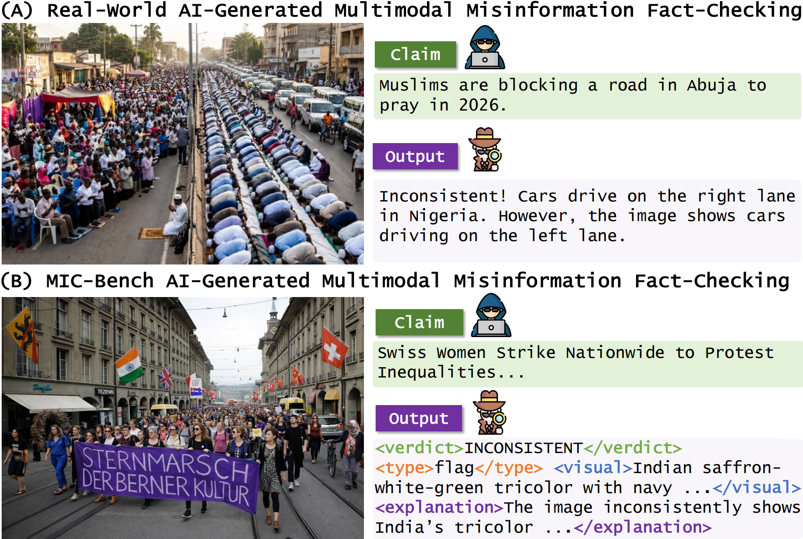

# MIC: Explaining Image–Claim Inconsistencies in AI-Generated Multimodal Misinformation

[](LICENSE)
[](https://www.python.org/)

This repository contains the code for **MIC (Multimodal Inconsistency Checking)** and the **MIC-Bench** construction pipeline associated with *MIC: Explaining Image–Claim Inconsistencies in AI-Generated Multimodal Misinformation*. The paper's arXiv submission is pending.

The original code is released under the **Apache License 2.0**. Bundled frameworks retain their upstream licenses. Images, datasets, and model weights are subject to their respective providers' terms; see [License](#license).

Contact person: [Ruihong Zeng](mailto:zengrh3@gmail.com) (zengrh3@gmail.com).

[UKP Lab](https://www.ukp.tu-darmstadt.de/) | [TU Darmstadt](https://www.tu-darmstadt.de/)

For questions, bug reports, or help reproducing the experiments, please email the contact person or [open an issue](https://github.com/UKPLab/arxiv2026-mic/issues).

<p align="center">
  
</p>

## Contents

- [Abstract](#abstract)
- [tl;dr](#tldr)
- [Datasets](#datasets)
- [Environment](#environment)
- [Experiments](#experiments)
- [Repository structure](#repository-structure)
- [Citation](#citation)
- [Acknowledgments](#acknowledgments)
- [License](#license)
- [Disclaimer](#disclaimer)

## Abstract

> Claims paired with AI-generated images are a growing form of misinformation. MIC checks whether an image is consistent with its accompanying claim, identifies conflicting visual evidence, and explains the contradiction using world knowledge. MIC-Bench contains 8,812 image–claim instances from 4,406 claims, each paired with an authentic image and an AI-generated counterpart with a controlled contextual inconsistency. The benchmark covers nine inconsistency types. MIC combines supervised fine-tuning with Group Relative Policy Optimization using component-level verifiable rewards. This repository provides the benchmark construction pipeline, training configurations, inference code, and evaluation of verdicts, inconsistency types, visual evidence, and explanations.

## tl;dr

- **Task:** check image–claim consistency and explain contradictions using visual evidence and world knowledge.
- **Benchmark:** MIC-Bench pairs authentic and edited images while keeping their claims unchanged; see [Datasets](#datasets).
- **Training:** adapt Qwen3-VL-4B-Instruct through SFT followed by GRPO.
- **Evaluation:** report verdict, inconsistency type, visual evidence, and explanation metrics on ID and OOD splits.
- **Reproduce the data:** use the provided source URLs, editing instructions, annotations, and splits; download the original images and regenerate their edited counterparts. See [Data preparation](#data-preparation).

## Datasets

### MIC-Bench

MIC-Bench comprises **8,812 image–claim instances from 4,406 claims**. Each claim is paired with an authentic image and an AI-generated counterpart containing a controlled contextual inconsistency. The claim is retained during image editing.

The benchmark covers nine inconsistency types: `clothing`, `flag`, `gesture`, `signage`, `architecture`, `infrastructure`, `technology`, `branding`, and `environment`.

The source images come from **TARA**. The released text artifacts include source URLs, per-image editing instructions, edit types, annotations, available teacher rationales, and fixed claim-level splits. The main image generator is `gpt-image-1.5`; **FLUX.2-klein-9B** provides an alternative generator for the test sets.

### Data preparation

**You only need to recreate the images.** Source URLs and editing prompts are ready to run in `data/editing_prompts.json`; the four main files in `data/splits/` provide fixed membership and complete labels. There is no need to run screening, prompt generation, annotation generation, or split construction again.

From the repository root, in a Python 3.11 environment:

```bash
pip install -r requirements.txt
export OPENAI_API_KEY="YOUR_API_KEY"
python -m data_construction reproduce --backend gpt-image
```

This command downloads the selected authentic images from their recorded URLs, applies each supplied editing prompt with `gpt-image-1.5`, and writes images and matching split manifests under `data/reproduced/gpt-image/`. It resumes completed work automatically. Image generation uses your OpenAI API account. To try five pairs first, add `--limit 5`; to inspect the workload without downloading images or calling a model, add `--dry-run`.

**Generated images may differ from those used in the paper**, even with the same model and prompt. Check that the regenerated edits still match the supplied annotations before training or evaluation. The output marks new generations as requiring review; historical reviews describe the original generated images.

See the [image recreation guide](data_construction/README.md) for FLUX.2, source-image reuse, resuming, and output locations. The [data reference](data/README.md) documents the included files, split counts, and annotation schema. Source images, generated images, and the full upstream TARA `input/` directory are not included in Git.

After checking the regenerated images, point the training and evaluation commands below at their data root:

```bash
export MIC_DATA_ROOT="$PWD/data/reproduced/gpt-image"
```

Alternatively, pass `--data-root data/reproduced/gpt-image` to each command. Its matching `splits/` directory is selected automatically.

## Environment

Use **Python 3.11** and run the commands below from the repository root.

```bash
git clone https://github.com/UKPLab/arxiv2026-mic.git
cd arxiv2026-mic
python3.11 -m venv .venv
source .venv/bin/activate
pip install -r requirements.txt
```

All project dependencies for GPT Image and FLUX.2 image recreation, inference, evaluation, and training support are listed in [requirements.txt](requirements.txt). The vLLM dependency is installed on Linux.

For hosted model calls, set `OPENAI_API_KEY` in your shell or copy [.env.example](.env.example) to `.env` and fill in the key. Choose PyTorch and vLLM builds compatible with your accelerator environment.

Use separate environments for SFT and GRPO. From the repository root, install the bundled frameworks and the dependencies used by the MIC configurations:

```bash
# In a separate SFT environment:
pip install -r requirements.txt -e ./LlamaFactory

# In a separate GRPO environment:
pip install -r requirements.txt -e "./training/verl[vllm,geo]"
```

The GRPO configuration also uses FlashAttention 2; install a build compatible with your PyTorch, CUDA, and GPU environment. See the bundled [LlamaFactory installation instructions](LlamaFactory/README.md#installation) and [verl setup instructions](training/verl/README.md#getting-started) for accelerator setup. These installation ranges follow the bundled package declarations.

## Experiments

Run commands from the repository root after completing [Environment](#environment) setup and [Data preparation](#data-preparation).

### Training

Training uses **Qwen3-VL-4B-Instruct**. Its SFT and adapter-merge configurations are in [configs/sft/](configs/sft/).

#### 1. Supervised fine-tuning

With the images and `train.json` / `val.json` manifests in place, prepare the ShareGPT data and LlamaFactory dataset registry:

```bash
python -m src.training.prepare --format sft
```

The converter preserves usable teacher reasoning and rebuilds the final answer from the reference labels. See the [annotation schema](data/README.md#annotation-schema).

In your SFT environment, train the LoRA adapter and merge it into the base model:

```bash
llamafactory-cli train configs/sft/qwen3vl4b.yaml
llamafactory-cli export configs/sft/merge_qwen3vl4b.yaml
```

The default merged checkpoint is written to `outputs/merged/qwen3vl4b`.

#### 2. GRPO

Prepare the training and validation Parquet files:

```bash
python -m src.training.prepare --format grpo
```

In your GRPO environment, launch training from the merged SFT checkpoint:

```bash
bash scripts/train_grpo.sh
```

The launcher defaults to **8 GPUs on one node**. Set `N_GPUS_PER_NODE`, `MODEL_PATH`, `GRPO_DATA_DIR`, or `RUN_DIR` to override the GPU count and paths. Training settings are in [configs/grpo/mic.yaml](configs/grpo/mic.yaml), and component rewards are implemented in [src/training/reward.py](src/training/reward.py).

Export a selected GRPO actor checkpoint to Hugging Face format. Replace `STEP` with the saved training step and choose a new output directory:

```bash
bash scripts/export_grpo.sh \
  outputs/grpo/qwen3vl4b/global_step_STEP/actor \
  outputs/exported/mic
```

### Inference and evaluation

#### Run inference

After installing the local inference dependencies, evaluate the exported MIC checkpoint on the ID split:

```bash
python -m src.run_infer \
  --model outputs/exported/mic \
  --backend vllm \
  --split test_id \
  --prompt canonical \
  --run-name mic_id
```

For the SFT-only model, use `--model outputs/merged/qwen3vl4b`. For OOD evaluation, use `--split test_ood` and a separate run name such as `mic_ood`. Hosted inference uses `--backend api --provider openai` with an API model name.

Inference resumes existing results by default and checks run, model, prompt, inference settings, claims, generators, and image checksums before appending. Use a new `--run-name` when changing settings or input images, including when switching to FLUX.2. Older predictions without input checksums cannot be resumed; `--no-skip-existing` starts a fresh prediction file for the selected run. Malformed or mixed prediction files are rejected before scoring.

#### Score predictions

```bash
python -m src.run_score \
  --predictions results/predictions/mic_id.jsonl \
  --split test_id
```

Scoring reports verdict metrics, inconsistency type accuracy, visual evidence similarity, and explanation similarity. Similarity scoring uses **Qwen3-Embedding-0.6B** by default. Use `--skip-embed` to compute only verdict and type metrics. For deliberately partial runs, pass `--allow-partial` to include coverage in the report.

Predictions are saved to `results/predictions/`. Per-instance scores and aggregate `.summary.json` files are saved to `results/scored/`.

#### Expected results

A completed inference run produces one structured prediction per selected instance. Evaluation produces per-instance scores and an aggregate report for verdict, inconsistency type, visual evidence, and explanation. Numeric reproduction results require the released checkpoint and the exact reviewed images used in the paper. The text manifests are included; checkpoint and original generated-image archive links are pending. Recreated images form a new rendering of the benchmark and may produce different scores.

#### Parameter description

| Parameter | Purpose |
| --- | --- |
| `--model` | Local checkpoint path or hosted model identifier for inference |
| `--backend` | Inference runtime: `vllm` or `api` |
| `--split` | Benchmark split to infer or score |
| `--data-root`, `--split-root` | Override image and manifest directories |
| `--run-name` | Name of the prediction run |
| `--predictions` | Prediction JSONL file to score |
| `--skip-embed` | Score verdict and type without embedding models |
| `--format` | Training preparation output: `sft` or `grpo` |

Run the corresponding command with `--help` for all available options and defaults.

#### Output format

The canonical response uses the following tags; the text below illustrates the format:

```xml
<think>Reasoning grounded in visible evidence.</think>
<verdict>INCONSISTENT</verdict>
<type>flag</type>
<visual>Description of the conflicting flag visible in the image.</visual>
<explanation>World knowledge explaining why this flag contradicts the claim.</explanation>
```

For `CONSISTENT` predictions, `type`, `visual`, and `explanation` must each be `None`. See the [canonical prompt](src/prompts.py) and [response parser](src/parsers/cot_tagged.py) for the full contract.

## Repository structure

```text
arxiv2026-mic/
├── src/                # MIC inference, evaluation, and shared utilities
│   ├── backends/       # vLLM and hosted inference
│   ├── parsers/        # Structured response parsing
│   ├── metrics/        # Evaluation metrics
│   ├── training/       # Training data conversion and component rewards
│   ├── data.py         # Dataset loading, validation, and prediction I/O
│   ├── run_infer.py    # Inference entry point
│   ├── run_score.py    # Evaluation entry point
│   └── ...             # Prompts, schema, and text embeddings
├── data_construction/  # Source preparation, editing, review, splits, and README
├── configs/
│   ├── sft/            # SFT and adapter-merge configurations
│   └── grpo/           # GRPO configuration
├── data/               # Data schema and local benchmark files
├── LlamaFactory/       # Bundled SFT framework
├── training/
│   └── verl/           # Bundled GRPO framework
├── pic/                # README figures
├── scripts/            # GRPO launch and checkpoint export
├── .github/            # Issue templates and pull request template
└── requirements.txt    # Project dependencies
```

## Citation


```bibtex
@misc{zeng-etal-mic,
  title = {{MIC}: Explaining Image--Claim Inconsistencies in {AI}-Generated Multimodal Misinformation},
  author = {Zeng, Ruihong and Tonglet, Jonathan and Nakov, Preslav and Gurevych, Iryna},
  year = {},
  eprint = {},
  archivePrefix = {arXiv},
  url = {}
}
```

## Acknowledgments

MIC builds on [TARA](https://github.com/zeyofu/TARA) for source image–claim data, [LlamaFactory](LlamaFactory/) for supervised fine-tuning, and [verl](training/verl/) for reinforcement learning. See [THIRD_PARTY_NOTICES.md](THIRD_PARTY_NOTICES.md) for component attribution and licenses.

## License

MIC's original code is released under the **Apache License 2.0**; see [LICENSE](LICENSE). Bundled third-party code retains its upstream licenses and notices. Images, datasets, and model weights are subject to their respective providers' terms.

## Disclaimer

> This repository contains experimental software and is published for the sole purpose of giving additional background details on the respective publication.
